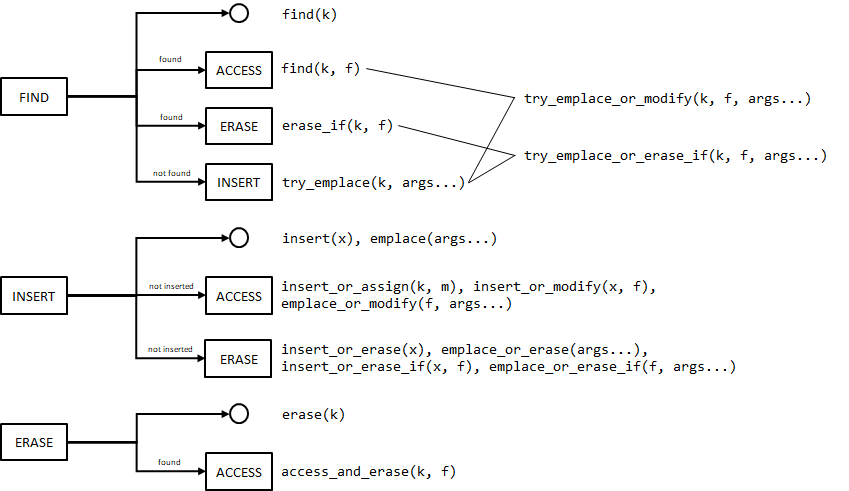

# Notes for the design of a concurrent hashmap API

## Prior art

### oneTBB

[`oneapi::tbb::concurrent_hash_map`](https://spec.oneapi.io/versions/latest/elements/oneTBB/source/containers/concurrent_hash_map_cls.html)
introduces the notion of [_accessors_](https://spec.oneapi.io/versions/latest/elements/oneTBB/source/containers/concurrent_hash_map_cls/accessors.html),
objects with smart pointer semantics that provide locked access to a given element.
For instance, the following:
```cpp
tbb_map_type::accessor acc;
map.emplace(acc, key, 0);
++acc->second;
```
emplaces a new element (or locates an equivalent one) and provides access to it via `acc`. There
are const (shared lock) and non-const (exclusive lock) accessors. Member functions
`find`, `insert`, `emplace` have additional overloads accepting accessors. Rather than returning
iterators, these functions return a `bool` (indicating if the element was found in the case
of `find`, or whether the element has been inserted in the case of `insert` and `emplace`).
There are non-standard overloads of `insert` accepting a key rather than a full value —so,
`insert(acc, k)` behaves as (non-existent) `try_emplace(acc, k)`.
`operator[]` is not provided. `erase([const_]iterator)` is logically replaced by
`erase([const_]accessor)`.

`rehash` is thread-safe. Additional functionality is provided _without
thread safety guarantees_:
* iterators,
* assignment,
* `clear` and `swap`.

Parallel iteration is served through [_container ranges_](https://spec.oneapi.io/versions/latest/elements/oneTBB/source/named_requirements/containers/container_range.html),
which behave like C++17 ranges but provide additional splitting functionalities to
distribute the range load traversal across threads. Parallel iteration is
not thread-safe, that is, when parallel-iterating a container no other
operations can be performed on the container.

### libcuckoo

[`libcuckoo::cuckoohash_map`](https://efficient.github.io/libcuckoo/classlibcuckoo_1_1cuckoohash__map.html)
does not have iterators. The thread-safe lookup/modify interface is as follows:
* `mapped_type find(const K&)`, `bool find(const Key&, mapped_type&)`, `bool find_fn(const K&, F)`
* `bool contains(const K&)`
* `bool insert(K&&, Args&&...)`, `bool insert_or_assign(K&&, V&&)`
* `bool update_fn(const K&, F)`
* `bool uprase_fn(K&&, F, Args&&...)`
* `bool upsert(K&&, F, Args&&...)`
* `bool erase(const K&)`

`mapped_type find(const K&)` throws if the element is not found. `bool find(const Key&, mapped_type& x)`
copies the mapped value of the element found to `x`. Despite its name, `bool insert(K&&, Args&&...)`
has rather the semantics of `std::unordered_map::try_emplace`. `update_fn` is equivalent to
`find_fn`, except that the user-provided function is passed a non-const reference to the
mapped value. `uprase_fn` behaves like `std::unordered_map::try_emplace`, but additionally
passes a reference to the mapped value to the user-provided function, along with information on
whether the element has been newly created or was preexistent: the function can further indicate
if the elements is to be erased. `upsert` is a variation of `uprase_fn` where the element
is never erased. `operator[]` is not provided.

Assignment is not thread-safe. `rehash`, `reserve`, `clear` and `swap`, on the other hand,
can be called in a concurrent scenario.

`lock_table` blocks all concurrent accesses and returns a [`locked_table`](https://efficient.github.io/libcuckoo/classlibcuckoo_1_1cuckoohash__map_1_1locked__table.html) view over the underlying data structure
providing iterators and an interface more or less equivalent to that of `std::unordered_map`.
This functionality is meant to support scenarios such as concurrent population followed by
non-concurrent usage, for instance.

### `std::concurrent_unordered_map` proposal

[P0652R3](https://wg21.link/p0652r3) proposes an interface for an (as of yet not accepted)
`std::concurrent_unordered_map` container. `std::concurrent_unordered_map` does not have
iterators. More controversially, it also omits `size`, `count` and `empty` on the grounds
that, in a multithreaded scenario, the values returned can not be trusted.
The thread-safe lookup/modify interface is split into _visitation member
functions_ (accepting a user-provided functor for access to the elements) and non-visitation
member functions. The visitation interface is as follows:
* `void visit(const key_type&, Visitor&)` (const and non-const)
* `void visit_all(Visitor&)`  (const and non-const)
* `bool visit_or_emplace(K&&, Visitor&, Args&&...)` (non-const only)

Visitors are passed const/non-const references to the mapped value type depending on
whether the const or non-const version of the member function is used, respectively
—internally, this implies that either shared or exclusive locking is used.
`visit_all` also passes a `const key_type&` to the visitor.
`visit_or_emplace` only calls the visitor if an equivalent element already existed,
and returns `true` iff the element has been newly created. 

The non-visitation interface is:
* `optional<mapped_type> find(const key_type&)`
* `mapped_type find(const key_type&, Args&&...)`
* `bool emplace(K&& key, Args&&...)`
* `bool insert_or_assign(K&&, Args&&...)`
* `size_type update(const key_type&, Args&&...)`
* `size_type erase(const key_type&)`

`find(key, args...)` returns a copy of the mapped value type
of the element with equivalent to `key`, if it exists, and else it returns a `mapped_type`
constructed from `args...`: the intended usage of this member function escapes
the author of these notes. `emplace` and `insert_or_assign` behave as
their homonyms in `std::unordered_map` except that they don't return an iterator.
`update` replaces the mapped value type of the looked-up element and does
nothing otherwise (that is, it does not create an element like is the case
with `insert_or_assign`); as it happens, `update` can be implemented as a
wrapper over non-const `void visit(const key_type&, Visitor&)`.
`operator[]` is not provided.

All operations of `std::concurrent_unordered_map` are thread-safe,
including assignment, `merge`, `swap` and `clear`. No rehashing facilities
are provided.

`make_unordered_map_view(lock)` returns an `unordered_map_view` over the underlying
data structure (the `bool` parameter `lock` specifies whether concurrent accesses to
the parent `concurrent_unordered_map` are blocked or not).
`unordered_map_view` interface mimics that of `std::unordered_map`, without the
usual construction and assignment operations, and with some
deviations on _"iterator invalidation requirements, load_factor functions, `size()`
complexity requirements, buckets and node operations"_ —the proposal, which is
clearly incomplete, gets rather vague at this point, as these deviations are not
explained, and the synopsis offered includes funcionality typically associated
to closed-addressing implementations, like a full-fledged bucket interface
with local iterators.

### gtl 

[gtl parallel hash containers](https://github.com/greg7mdp/gtl/blob/main/docs/phmap.md)
include not only concurrent maps, but also concurrent sets, and node-based variations of those:
for brevity, the rest of the discussion focuses on `gtl::parallel_flat_hash_map`.

`gtl::parallel_flat_hash_map` provides a classical interface mimicking that of `absl::flat_hash_map`,
and most member functions properly lock the underlying data structure on execution,
but the iterators _are not thread-safe_ (they are not locked on the pointed to
element): so, iterator-based functionalities and member functions returning
an element reference (`operator[]`) are esentially thread-unsafe. Additionally,
the following thread-safe, function-based operations are provided:
* `bool if_contains(const K&, F&&)`
* `bool modify_if(const K&, F&&)`
* `bool erase_if(const K&, F&&)`
* `bool try_emplace_l(K&&, F&&, Args&&...)`
* `bool lazy_emplace_l(const K&, FExists&&, FEmplace&&)`
* `void for_each(F&&)` (const) 
* `void for_each_m(F&&)` (non-const)
* `void with_submap(size_t, F&&)` (const)
* `void with_submap_m(size_t, F&&)` (non-const)

`if_contains(key, f)` and `modify_if(key, f)` provide read and write access, respectively,
to the element equivalent to `key`. `erase_if(key, f)` erases the element `x`
equivalent to `key` iff `f(x)` returns true.
`try_emplace_l(k, f, args...)` inserts an element constructed with
(`k`, `args...`) and returns `true`, or invokes `f(x)` and returns `false`
if there's a preexistent equivalent element `x`.
`lazy_emplace_l(key, fExists, fEmplace)` looks for
an element equivalent to `key`: if it exists, invokes `fExists` on it, otherwise,
a so-called _constructor object_ is passed to `fEmplace` to allow for
element creation:

```cpp
map.lazy_emplace_l(
  5,
  [](tbb_map_type::value_type& x){ x.second = 6; },     // update
  [](tbb_map_type::constructor& ctor){ ctor(5, 13); }); // or create
```

(Incidentally, the implementation does not check that the element created is
actually equivalent to `key`, which can lead to a violation of the container
invariants). `for_each` and `for_each_m` allow for read and write traversal
of the container, respectively, whereas `with_submap` and `with_submap_m` perform
_submap_ traversal (`gtl::parallel_flat_hash_map` implementation is based on
sharding).

### Comparison table

||oneTBB|libcuckoo|P0652R3 proposal|gtl|
|:--|:-:|:-:|:-:|:-:|
|Containers provided|map|map|map|map, set and node-based variations|
|Iterators|unsafe|no|no<br/><sup>(safe traversal with `visit_all`)</sup>|unsafe<br/><sup>(safe traversal with `for_all[_m]`)</sup>|
|Assignment|unsafe|unsafe|safe|unsafe|
|Rehash|safe|safe|no|safe|
|`clear`, `swap`|unsafe|safe|safe|safe|
|`size`, `count`, `empty`|safe|safe|no|safe|
|`operator[]`|no|no|no|unsafe|
|Lookup/modify interface|adapted classical interface plus accessor-based overloads|adapted classical interface plus functor-based `find_fn`, `update_fn`, `uprase_fn`, `upsert`|adapted classical interface plus `visit`, `visit_or_emplace`, `update`|unsafe classical interface plus functor-based `if_contains`, `modify_if`, `erase_if`, `try_emplace_l`, `lazy_emplace_l`|
|Parallel iteration|with splittable ranges (unsafe)|no explicit support|no explicit support|with `with_submap[_m]` (safe)|
|Thread-unsafe view|no|yes<br/><sup>(locks parent container)</sup>|yes<br/><sup>(parent locking specified by user)</sup>|no|

## Design guidelines

* The entire map interface must be thread-safe, including assignment.
In the case of assignment, the implementation must be protected against potential
deadlock scenarios such as the following:
```cpp
// Thread 1
map1=map2;

// Thread 2
map2=map1;
```

* Don't provide iterators or accessors, either blocking or not: if not-blocking, they're
unsafe, and if blocking they increase contention when not properly used,
and can very easily lead to deadlocks:
```cpp
// Thread 1
map_type::iterator it1=map.find(x1), it2=map.find(x2);

// Thread 2
map_type::iterator it2=map.find(x2), it1=map.find(x1);
```
* Don't provide `operator[]` (thread-unsafe). This is syntactic sugar and can be
replaced by safe alternatives.
* Provide `size`, `empty`, `count`. Even though P0652R3 deems these member functions
useless and dangerous, they don't behave differently to any other
lookup/modify method in that the status of the container may change as
soon as the operation completes. Moreover, this information is useful
and reliable in the second stage of common population+access scenarios.
* Access to elements shall be in read or write mode based on whether the
member function used is const or not, respectively.
* Provides some means of doing parallel iteration.

## Open questions

* Do we provide `concurrent_unordered_flat_map::operator==`?
* In addition to `concurrent_unordered_flat_map`, do we want any of
`concurrent_unordered_flat_set` and `concurrent_unordered_node_[map|set]`?
* A variation of `concurrent_unordered_node_map` can internally store
`std::shared_ptr<value_type>`s and provide accesor-like, non-blocking, thread-safe
access to the elements (without the guarantee that elements remain in the map during
the accessor lifetime). Is this a valuable data structure?
* Do we want to provide a (blocking or not) thread-unsafe view over the map, in the
same way as libcukcoo and P0652R3 do? There's the additional possibility of
providing O(1) move assignment from `concurrent_hash_map` to `unordered_flat_map`
(move assignment in the opposite direction would be O(n) but fairly cheap).

## A systematic approach to designing our lookup/modify interface

Iterators allow for composition of several operations on the same element
—for instance, find an element and erase it or not based on some check on its
mapped value. In the absence of iterators, composite operations are not possible
(elements can't be referenced once a basic map operation has completed), so
we need to extend the map interface to cover most (hopefully all) composite
operations natively. The following is an attempt at designing such interface.

There are only four basic operations or "primitives" one can perform on a value/element:
**FIND**, **ACCESS**, **INSERT** and **ERASE** (read and write access are generically
covered by **ACCESS**, and **INSERT** comprises both insertion and emplacement).
We can derive an exhaustive diagram of how these operations can be meaningfully
composed over the same element, which naturally yields our extended map interface:



Some observations for discussion:

* `find(k)` is entirely equivalent to `contains(k)`, so we may consider removing it.
* `find(k, f)` could also be named `visit` à la P0652R3.
* Similarly, all `*_or_modify` operations could be named `*_or_visit`. `access_and_erase`
can be named `modify_and_erase` or `visit_and_erase`.
* `*_or_modify(..., f, ...)` operations can be trivially emulated with
`*_or_erase_if(..., [&](auto& x){ f(x); return false; }, ...)`, but it seems reasonable
to keep `*_or_modify` as their intent is quite different.
* `*_or_erase[_if]` operations serve a rather exotic scenario (erase an
element if it caused a collision on insertion) and could be emulated by an insertion
operation followed by `erase_if` on failure, although less efficiently
and in a non-atomic manner (which is probably unobservable anyway). We should decide
whether we keep them for completeness or if we drop them. 

## On parallel iteration

We can provide parallel iteration in a number of ways:
* _Externally_ by exposing a traversal facility that can be taken advantage of by
parallelization frameworks. The two obvious options are:
  * oneTBB through the notion of [container ranges](https://spec.oneapi.io/versions/latest/elements/oneTBB/source/named_requirements/containers/container_range.html).
  * Standard parallel algorithms through regular forward iterators.
* _Internally_, that is, via an specializad overload of, say, `visit_all` whose
implementation does the parallelization work.

As for external solutions, oneTBB is far from being a de facto standard in C++,
which leaves us with standard parallel algorithms. The main problem here is that,
if provided, iterators would not be easily made random-access, and iterator
increment is particularly slow for our data structure.

Internal parallelization, on the other hand, can be implemented very efficiently
by traversing element _groups_ rather than individual slots:

```cpp
// exposition only
template<typename ExecutionPolicy, typename F>
void visit_all(ExecutionPolicy&& policy, F f)
{
  auto lck=shared_access();
  std::for_each(
    std::forward<ExecutionPolicy>(policy),
    groups_begin(), groups_end(), // random-access iterators
    [&,this](group& g){
      auto lckg=exclusive_access(g);
      auto mask=g.match_occupied();
      while(mask){
        auto n=unchecked_countr_zero(mask);
        f(element(g, n));
        mask&=mask-1;
      }
    }
  }
}
```

## Proposed synopsis

```cpp
template<
  typename Key, typename T,
  typename Hash=boost::hash<Key>,
  typename Pred=std::equal_to<Key>,
  typename Allocator=std::allocator<std::pair<const Key, T>>
>
class concurrent_unordered_flat_map
{
public:
  // types
  using key_type       = Key;
  using mapped_type    = T;
  using value_type     = std::pair<const Key, T>;
  using init_type      = std::pair<
                           typename std::remove_const<Key>::type,
                           typename std::remove_const<T>::type
                         >;
  using hasher         = Hash;
  using key_equal      = Pred;
  using allocator_type = Allocator;
  using size_type      = std::size_t;
  
  // construct/copy/destroy
  concurrent_unordered_flat_map();
  explicit concurrent_unordered_flat_map(size_type n,
                                         const hasher& hf = hasher(),
                                         const key_equal& eql = key_equal(),
                                         const allocator_type& a = allocator_type());
  template<typenamme InputIterator>
    concurrent_unordered_flat_map(InputIterator f, InputIterator l,
                                  size_type n = implementation-defined,
                                  const hasher& hf = hasher(),
                                  const key_equal& eql = key_equal(),
                                  const allocator_type& a = allocator_type());
  concurrent_unordered_flat_map(const concurrent_unordered_flat_map& x);
  concurrent_unordered_flat_map(concurrent_unordered_flat_map&& x);
  template<typename InputIterator>
    concurrent_unordered_flat_map(InputIterator f, InputIterator l, const allocator_type& a);
  explicit concurrent_unordered_flat_map(const Allocator& a);
  concurrent_unordered_flat_map(const concurrent_unordered_flat_map& x, const Allocator& a);
  concurrent_unordered_flat_map(concurrent_unordered_flat_map&& x, const Allocator& a);
  concurrent_unordered_flat_map(std::initializer_list<value_type> il,
                                size_type n = implementation-defined
                                const hasher& hf = hasher(),
                                const key_equal& eql = key_equal(),
                                const allocator_type& a = allocator_type());
  concurrent_unordered_flat_map(size_type n, const allocator_type& a);
  concurrent_unordered_flat_map(size_type n, const hasher& hf, const allocator_type& a);
  template<typename InputIterator>
    concurrent_unordered_flat_map(InputIterator f, InputIterator l, size_type n, const allocator_type& a);
  template<typename InputIterator>
    concurrent_unordered_flat_map(InputIterator f, InputIterator l, size_type n, const hasher& hf,
                                  const allocator_type& a);
  concurrent_unordered_flat_map(std::initializer_list<value_type> il, const allocator_type& a);
  concurrent_unordered_flat_map(std::initializer_list<value_type> il, size_type n,
                                const allocator_type& a);
  concurrent_unordered_flat_map(std::initializer_list<value_type> il, size_type n, const hasher& hf,
                                const allocator_type& a);
  ~concurrent_unordered_flat_map();
  
  concurrent_unordered_flat_map& operator=(const concurrent_unordered_flat_map& other);
  concurrent_unordered_flat_map& operator=(concurrent_unordered_flat_map&& other)
    noexcept(std::allocator_traits<Allocator>::is_always_equal::value ||
             std::allocator_traits<Allocator>::propagate_on_container_move_assignment::value);
  // Concurrency: Blocking on *this and other. 
             
  concurrent_unordered_flat_map& operator=(std::initializer_list<value_type>);
  // Concurrency: Blocking. 

  allocator_type get_allocator() const noexcept;    
  
  // visitation
  template<typename F> std::size_t visit(const key_type& k, F f) const;
  template<typename F> std::size_t visit(const key_type& k, F f);
  template<typename F> std::size_t visit(key_type&& k, F f) const;
  template<typename F> std::size_t visit(key_type&& k, F f);
  template<typename K,typename F> std::size_t visit(K&& k, F f) const;
  template<typename K,typename F> std::size_t visit(K&& k, F f);
  // Effects: If an element equivalent to k is found, passes a (const) reference to it to f.
  // Returns: Number of elements visited (0 or 1).
  
  template<typename F> std::size_t visit_all(F f) const;
  template<typename F> std::size_t visit_all(F f);
  // Effects: Successively passes (const) references to all the elements in the
  // container to f.
  // Returns: Number of elements visited.
  // Concurrency: Non-blocking.
  
  template<typename ExecutionPolicy, typename F> void visit_all(ExecutionPolicy&& policy, F f) const;
  template<typename ExecutionPolicy, typename F> void visit_all(ExecutionPolicy&& policy, F f);
  // Effects: Passes (const) references to all the elements in the container to f, with no
  // guaranteed order and using the specified parallel execution policy.
  // Exceptions: As parallel std::for_each.
  // Concurrency: Non-blocking.
  
  // capacity
  [[nodiscard]] bool empty() const noexcept;
  size_type size() const noexcept;
  size_type max_size() const noexcept;

  // modifiers
  template<typename... Args> bool emplace(Args&&... args);
  bool insert(const value_type& obj);
  bool insert(const init_type& obj);
  bool insert(value_type&& obj);
  bool insert(init_type&& obj);
  template<typename InputIterator> void insert(InputIterator first, InputIterator last);
  void insert(std::initializer_list<value_type> il);  

  template<typename... Args> bool try_emplace(const key_type& k, Args&&... args);
  template<typename... Args> bool try_emplace(key_type&& k, Args&&... args);
  template<class K, typename... Args> bool try_emplace(K&& k, Args&&... args);
  
  template<typename F, typename... Args> bool try_emplace_or_visit(const key_type& k, F f, Args&&... args);
  template<typename F, typename... Args> bool try_emplace_or_visit(key_type&& k, F f, Args&&... args);
  template<class K, typename F, typename... Args> bool try_emplace_or_visit(K&& k, F f, Args&&... args);
  // Effects: Tries to emplace an element piecewise-constructed from k and args... If an equivalent
  // element already exists, passes a reference to it to f.
  // Returns: true iff emplacement took place.

  template<typename M> bool insert_or_assign(const key_type& k, M&& obj);
  template<typename M> bool insert_or_assign(key_type&& k, M&& obj);
  template<typename K, typename M> bool insert_or_assign(K&& k, M&& obj);
  
  template<typename F,typename... Args> bool emplace_or_visit(F f, Args&&... args);
  template<typename F> bool insert_or_visit(const value_type& obj, F f);
  template<typename F> bool insert_or_visit(const init_type& obj, F f);
  template<typename F> bool insert_or_visit(value_type&& obj, F f);
  template<typename F> bool insert_or_visit(init_type&& obj, F f);
  // Effects: Tries to emplace/insert an element constructed from args.../obj. If an equivalent
  // element already exists, passes a reference to it to f.
  // Returns: true iff emplacement/insertion took place.
  
  template<typename InputIterator,typename F>
    void insert_or_visit(InputIterator first, InputIterator last, F f);
  // Effects: while(first != last) this->insert_or_visit(*first++, f);

  template<typename F> void insert_or_visit(std::initializer_list<value_type> il, F f);
  // Effects: this->insert_or_visit(il.begin(), il.end(), f);
  
  size_type erase(const key_type& k);
  template<typename K> size_type erase(K&& k);
  
  template<typename F> size_type erase_if(const key_type& k, F f);
  template<typename F> size_type erase_if(key_type&& k, F f);
  template<typename K, typename F> size_type erase_if(K&& k, F f);
  // Effects: If an element equivalent to k is found, passes a reference to it to f
  // and erases it if f returns true.
  // Returns: Number of elements erased (0 or 1).
  
  template<typename F> size_type erase_if(F f);
  // Effects: Successively passes references to all the elements in the container to f,
  // and erases those for which f returns true. 
  // Returns: Number of elements erased.
  // Concurrency: Non-blocking.
  
  template<typename ExecutionPolicy, typename F> void erase_if(ExecutionPolicy&& policy, F f)
    requires std::is_execution_policy_v<std::remove_cvref_t<ExecutionPolicy>>;
  // Effects: Passes references to all the elements in the container to f, with no
  // guaranteed order and using the specified parallel execution policy, and deletes
  // those for which f returns true.
  // Exceptions: As parallel std::for_each.
  // Concurrency: Non-blocking.
  
  void swap(concurrent_unordered_flat_map& other)
    noexcept(std::allocator_traits<Allocator>::is_always_equal::value ||
             std::allocator_traits<Allocator>::propagate_on_container_swap::value);
  // Concurrency: Blocking on *this and x.
             
  void clear() noexcept;
  // Concurrency: Blocking.

  template<typename H2, typename P2>
    void merge(concurrent_unordered_flat_map<Key, T, H2, P2, Allocator>& x);
  template<typename H2, typename P2>
    void merge(concurrent_unordered_flat_map<Key, T, H2, P2, Allocator>&& x);
  // Concurrency: Non-blocking.
      
  // observers
  hasher hash_function() const;
  key_equal key_eq() const;
      
  // map operations
  size_type count(const key_type& k) const;
  template<typename K> size_type count(const K& k) const;
  bool contains(const key_type& k) const;
  template<typename K> bool contains(const K& k) const;  
  
  // hash policy
  float load_factor() const noexcept;
  float max_load_factor() const noexcept;
  void max_load_factor(float z);
  size_type max_load() const noexcept;
  
  void rehash(size_type n);
  void reserve(size_type n);
  // Concurrency: Blocking.
};
```
